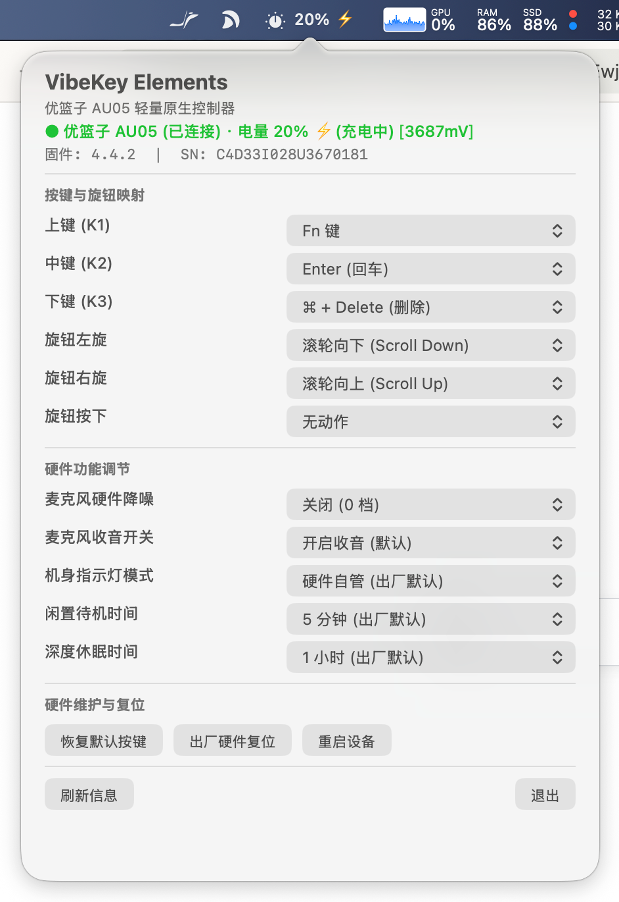

# VibeKey Elements

[English](README.md) | [简体中文](README_zh.md)

> **专为优篮子（Ulanzi）AU05 VibeKey 打造的轻量级原生 macOS 驱动与开发中心。**  
> *零厂商闭源动态库 · 纯 Swift 实现 TEA 硬件加密协议 · 实时菜单栏状态面板 · AI Agent 硬件状态指示 · 全功能 CLI 命令行套件*

<p align="center">
  
</p>

---

## 🌟 项目简介

**VibeKey Elements** 是一套专为优篮子 AU05（VibeKey）多功能调音控制器与无线麦克风打造的轻量级原生 macOS 控制中心。

它完全摆脱了官方驱动的沉重依赖与闭源动态库，以纯 Swift 实现了硬件级灯效调节、麦克风降噪切换、待机与休眠时间管理，并将硬件旋钮与按键无缝接入日常软件开发与 AI 编码工作流中。

---

## ✨ 核心特性

### 1. 纯 Swift TEA 硬件协议（零厂商闭源二进制）
- **100% 洁净室手搓实现**：完全使用 Swift 原生重构，不依赖任何第三方或厂商闭源动态库（`.dylib`）。
- **硬件级原生加解密**：完整实现 USB HID（Report ID `0x55`, 64 字节）上的 32 轮 TEA（Tiny Encryption Algorithm）分组加密协议。
- **透明安全且秒开**：启动速度以毫秒计，内存占用极低，彻底杜绝后台隐蔽驻留。

### 2. 原生设置面板与菜单栏状态中心
- **保持打开的设置面板**：左键单击菜单栏图标展开原生 AppKit Popover 面板，**在调节选项与切换映射时保持展开**，避免误关闭。
- **明确勾选标记（Checkmark）**：按键映射、麦克风降噪档位、机身指示灯模式均在面板和右键菜单中显示明确的选中打勾状态。
- **全面的硬件健康度监测**：实时读取并展示设备固件版本、机身硬件序列号（SN）、电池电量百分比、电压（mV）及充电闪电（⚡）状态。
- **接收器感知的电源状态**：设备关机但 2.4G 接收器仍连接时，会明确显示为关机而不是误报离线。
- **毫秒级按键闪烁反馈**：物理按键或旋转旋钮时，菜单栏即刻闪烁显示触发键位（如 `[K1]`、`[◀]`、`[●]`）。

### 3. AI 编码 Agent 硬件状态联动
- **桌面物理 Agent 状态灯**：通过命令行或 API 将控制器与 AI 编码 Agent（如 Codex、Claude Code、本地自动化脚本）实时联动：
  - `thinking`：柔和呼吸灯效，代表大模型正在推理思考。
  - `working`：明亮常亮灯效，代表 Agent 正在编写代码或调用工具。
  - `error`：红光警示闪烁，代表任务中断或测试失败。
  - `idle`：任务结束，自动恢复硬件默认控制。

### 4. 完整的硬件底层参数调节
- **麦克风硬件降噪（NR）**：4 档即时硬件级调节（0 档关闭、1 档低、2 档中、3 档高）。
- **闲置待机与休眠时间配置**：动态配置设备待机时间（如 5 分钟、15 分钟、30 分钟或从不待机）及深度休眠时间。
- **4 通道指示灯控制**：支持常亮、呼吸、熄灭与自动恢复默认硬件状态。

### 5. 超低功耗与休眠管理（待机零下行 RF 发射）
- **彻底杜绝隔夜掉电漏电**：根治优篮子 AU05 在 2.4G 接收器连接下放一晚上电池耗尽的硬件顽疾。
- **待机状态完全暂停下行心跳与轮询**：设备闲置进入待机、物理关机或 Mac 系统休眠时，驱动立即完全暂停所有下行轮询与心跳包，让 AU05 单片机真正进入微安级（约 15–30 µA）深度休眠。
- **可选长连保活模式**：高强度工作时可保持 0.8 秒心跳并暂停闲置省电切换；Mac 系统休眠时仍会强制进入零下行待机。
- **触碰任意按键毫秒级唤醒**：按下任意按键或旋转旋钮，驱动瞬间捕捉并恢复主机与设备通信。
- **自适应电池遥测频率**：常规工作时将电池轮询间隔放宽至 180 秒（3 分钟），降低 92% 的无效无线电空中流量。
- **macOS 系统休眠周期联动**：深度监听 `NSWorkspace.willSleepNotification` 与 `didWakeNotification`，防止 macOS DarkWake 在夜间意外唤醒设备。

### 6. 多动作映射引擎
- **键盘组合键与序列**：完美模拟单键、复杂快捷键组合（⌘、⌥、⌃、⇧）及独立 `Fn` 键。
- **高精度鼠标平滑滚动**：旋钮顺时针/逆时针平滑滚动视图。
- **异步 Shell 终端命令**：通过按键直接异步触发外部脚本与命令（`$ cmd`），界面丝滑不卡顿。

### 7. Sparkle 2 自动更新
- **后台自动静默检测**：默认每 7 天在后台查询一次最新可用版本（`SUScheduledCheckInterval = 604800`）。
- **用户完全自主控制**：支持跳过当前版本（Skip This Version）、稍后提醒（Remind Me Later）或取消；菜单栏及设置面板均提供「检查更新…」入口。
- **Ed25519 密码学签名验证**：所有更新分发与 appcast 均通过 Ed25519 公钥签名验证，杜绝篡改。

### 9. 本机私有诊断日志
- JSONL 事件写入 `~/Library/Logs/VibeKeyElements/events.jsonl`，文件权限为 `0600`。
- 记录接入/移除、电源/待机切换、HID 发送失败和动作触发，便于复现排查。

### 8. 全功能 `vibekey` CLI 命令行套件
- 可通过终端脚本、Raycast/Alfred 快捷指令或自动化流程管理硬件。
- `status` 会真实回读并输出电量、固件、序列号、待机/休眠时间和麦克风状态。
- `monitor` 实时输出按键、旋钮、电源通知和查询响应。
- `config` 输出生效的 `~/.config/vibekey/config.json`，且不会意外创建文件。

---

## 🚀 快速上手

### 📥 直接下载（已通过 Apple 官方公证的 DMG）

直接从 GitHub Releases 获取经官方公证签名的安装镜像：
- 📦 **[下载 VibeKey-Elements-macOS-arm64.dmg](https://github.com/patrick-fu/vibekey-elements/releases/latest/download/VibeKey-Elements-macOS-arm64.dmg)**

*(已通过 Apple Notary Service 官方公证，无需执行 Gatekeeper 绕过或清除隔离属性。)*

### 🔍 验证待机省电与零下行休眠效果

为了防止隔夜掉电，VibeKey Elements 在设备进入待机或 Mac 休眠时会完全终止所有 2.4G 下行通信。你可以通过 macOS 统一日志系统随时核验这一行为：

```bash
# 1. 实时流式查看电源状态切换日志
log stream --predicate 'subsystem == "com.patrickfu.vibekey"' --level debug

# 2. 回溯查询过去 12 小时的电源转换事件
log show --predicate 'subsystem == "com.patrickfu.vibekey" and category == "Power"' --last 12h
```

**预期日志输出**：
- 进入待机：`Entering power saving mode (isStandby: true, reason: InactivityTimeout). Halting heartbeat & polling timers.`
- 系统休眠：`macOS host sleep/power-off notification received. Forcing standby power saving mode.`
- 阻止暗唤醒：`Maintaining zero-downlink standby to prevent DarkWake RF wakeups.`
- 物理唤醒：`Physical input detected (k1) while in standby. Resuming.`
- 菜单栏状态：设备处于待机省电模式时，菜单栏电量旁会显示 `💤` 提示符。

---

### 🛠 从源码编译构建

系统要求：macOS 13.0+ 及 Xcode 15+ / Swift 5.9+。

```bash
git clone https://github.com/patrick-fu/vibekey-elements.git
cd vibekey-elements

# 编译 CLI 工具与菜单栏应用
swift build -c release

# 运行自动化测试套件
swift test
```

### 使用命令行工具 (`vibekey`)

编译后的 CLI 可执行文件位于 `.build/release/vibekey`：

```bash
# 在 2 秒超时内真实回读硬件状态
vibekey status

# 实时监听按键、旋钮和电源通知
vibekey monitor

# 查看当前生效的 JSON 配置
vibekey config

# 设置麦克风硬件降噪为中档（2 档）
vibekey set-nr 2

# 设置闲置待机时间为 30 分钟（1800 秒）
vibekey set-standby 1800

# 将通道 0 指示灯设为呼吸灯模式
vibekey led 0 breathing 80

# 恢复默认硬件灯效控制
vibekey reset-led

# 触发 AI 编码 Agent 状态钩子
vibekey hook thinking
vibekey hook idle
```

### 启动菜单栏应用

```bash
open .build/release/VibeKeyElements
```

---

## 🛠 代码架构

```text
vibekey-elements/
├── Sources/
│   ├── VibeKeyCore/          # 纯 Swift USB HID 驱动、32 轮 TEA 编解码与动作执行器
│   ├── vibekey-cli/          # 独立终端命令行工具 (`vibekey`)
│   └── VibeKeyElementsApp/   # 菜单栏应用与 AppKit 用户界面
└── Tests/
    └── VibeKeyCoreTests/     # 协议编解码验证、单元测试与消融实验套件
```

---

## 📄 开源许可证

MIT License © 2026 Patrick Fu.
